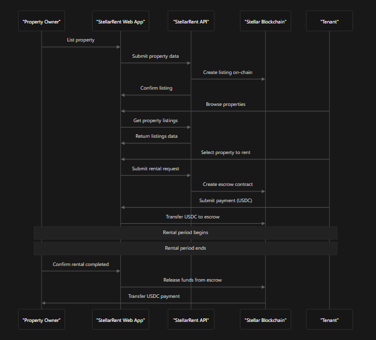
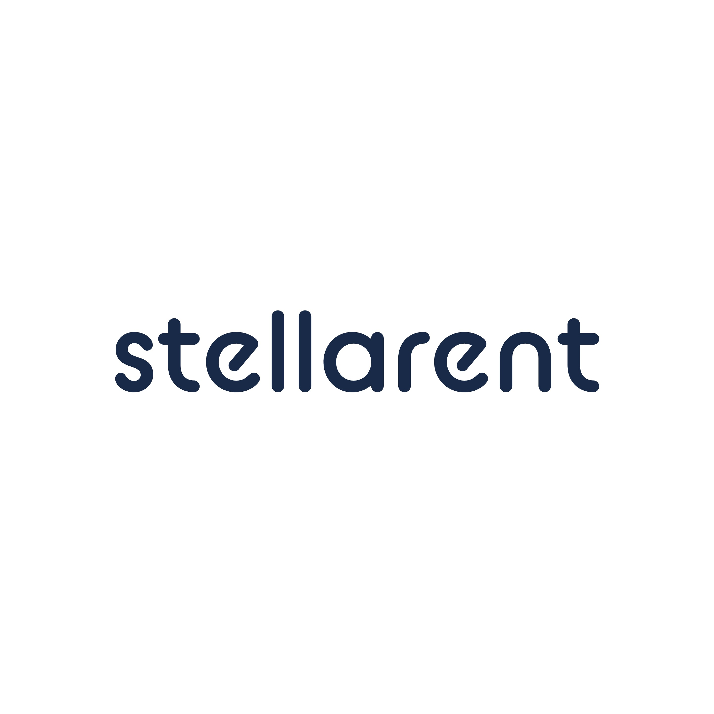

# StellarRent - Project Summary with Media Assets

## 🏠 Project Overview

**StellarRent** is a decentralized peer-to-peer (P2P) rental platform built on the Stellar blockchain, designed to revolutionize the rental market by offering instant USDC payments, ultra-low fees, and complete transparency.

### 🎯 Mission Statement
*"Empowering Global Rentals - Everyone deserves access to a fair rental marketplace with minimal fees, instant payments, and complete transparency, powered by blockchain technology."*

---

## 🏗️ Architecture & Technology Stack

### Core Architecture
StellarRent connects property owners and tenants through a decentralized platform on Stellar. Owners list properties via Soroban smart contracts, tenants pay with USDC, and payments are secured in an escrow contract until rental conditions are met.


*Sequence diagram showcasing core operations: list property, rent property, confirm rental, and payment escrow*

### Technology Stack
- **Frontend**: Next.js 14 with Tailwind CSS, TypeScript
- **Backend**: Node.js/Express with TypeScript
- **Database**: Supabase (PostgreSQL)
- **Blockchain**: Stellar with Soroban smart contracts
- **Authentication**: Email/password + Wallet authentication
- **Payments**: USDC on Stellar network
- **Containerization**: Docker for development

---

## 📊 Current Development Status

### ✅ Completed Features

#### Backend Infrastructure
- ✅ Complete database schema (users, profiles, properties, bookings, wallet_auth)
- ✅ Dual authentication system (email/password + wallet)
- ✅ User profiles with avatar upload and preferences
- ✅ Property management with search functionality
- ✅ Location services with autocomplete
- ✅ Booking system with payment confirmation endpoints
- ✅ Docker containerization for development

#### Frontend Core Features
- ✅ Responsive homepage with hero section
- ✅ Advanced property search with filters and map integration
- ✅ Property listing and detail pages
- ✅ Booking interface with confirmation flow
- ✅ Authentication UI (registration, login, wallet connection)
- ✅ Mobile-responsive design

#### Smart Contracts
- ✅ Soroban contracts for booking and property listing
- ✅ Comprehensive test suites
- ✅ Contract deployment automation

### 🔄 In Progress (High Priority)

#### Payment Integration
- 🔄 USDC payment infrastructure (partially complete)
- 🔄 Stellar SDK integration with booking system
- 🔄 Escrow contract functionality
- 🔄 Transaction status tracking

#### Dashboard Enhancements
- 🔄 Complete profile management interface
- 🔄 Booking history and status management
- 🔄 Host property management tools
- 🔄 Payment transaction interface

---

## 🎨 Media Assets & Branding

### Project Logos & Branding
<table>
  <tr>
    <td align="center">
      
      <br><strong>StellarRent Logo</strong>
    </td>
    <td align="center">
      
      <br><strong>Stellar Blockchain</strong>
    </td>
    <td align="center">
      
      <br><strong>OnlyDust Community</strong>
    </td>
  </tr>
</table>

### Architecture Diagrams
- **Core Operations Flow**: `assets/flow-stellar-rent.png` - Shows the complete rental process from listing to payment confirmation

### Frontend UI Assets
Located in `apps/web/public/`:
- **Icons**: 11 WebP icons (agenda, calendar, heart, location, lock, menu, message, search, send, settings, homepage-arrow)
- **Property Images**: 6 WebP house images for property listings
- **UI Elements**: SVG icons for navigation and interface elements

---

## 🚀 Key Features & Value Propositions

### For Property Owners (Hosts)
- **Ultra-low fees**: ~$0.000001 per transaction vs 7-20% on traditional platforms
- **Instant payments**: Receive USDC payments in 3-5 seconds
- **Transparent transactions**: All payments recorded on Stellar's public ledger
- **Smart contract security**: Automated escrow system protects both parties

### For Tenants (Guests)
- **Global access**: Rent properties worldwide with USDC
- **No hidden fees**: Transparent pricing with minimal transaction costs
- **Instant booking**: Secure payments processed in seconds
- **Blockchain verification**: Immutable records of all transactions

### Technical Advantages
- **Scalable architecture**: Built on Stellar's high-performance network
- **Developer-friendly**: Comprehensive API and smart contract system
- **Mobile-first**: Responsive design works on all devices
- **Open source**: Community-driven development with OnlyDust

---

## 📈 Project Metrics & Health

### Development Progress
- **Backend**: ~85% complete (payment integration remaining)
- **Frontend**: ~80% complete (dashboard enhancements needed)
- **Smart Contracts**: ~90% complete (integration testing needed)
- **Overall MVP**: ~85% complete

### Code Quality Indicators
- ✅ TypeScript implementation across all components
- ✅ Comprehensive test suites for smart contracts
- ✅ Docker containerization for consistent development
- ✅ Error handling and validation systems
- 🔄 Integration tests for end-to-end flows (in progress)

---

## 🎯 Immediate Roadmap (Next 30 Days)

### Priority 1: Complete Payment Integration
1. **Backend**: Finish USDC transaction flow with escrow
2. **Frontend**: Implement wallet payment interface
3. **Testing**: End-to-end payment flow validation

### Priority 2: Enhanced User Experience
1. **Dashboards**: Complete host and guest management interfaces
2. **Property Creation**: Image upload and availability calendar
3. **Error Handling**: Improved loading states and user feedback

### Priority 3: Smart Contract Integration
1. **API Integration**: Connect contracts with backend services
2. **Blockchain Sync**: Real-time data synchronization
3. **Security**: Comprehensive audit and testing

---

## 🤝 Community & Partnerships

### Development Partners
- **Stellar Development Foundation**: Core blockchain infrastructure
- **OnlyDust Community**: Open-source development platform
- **Community Contributors**: Active development community

### Getting Involved
- **GitHub**: [Stellar-Rent/stellar-rent](https://github.com/Stellar-Rent/stellar-rent)
- **OnlyDust**: [Project Page](https://app.onlydust.com/projects/stellarrent)
- **Telegram**: [Community Chat](https://t.me/stellarentdevs)
- **Documentation**: [GitBook](https://stellar-rent.gitbook.io/stellar-rent)

---

## 🛠️ Development Setup

### Quick Start with Docker
```bash
# Clone the repository
git clone https://github.com/Stellar-Rent/stellar-rent.git
cd stellar-rent

# Start with Docker (recommended)
docker-compose up -d

# Or follow detailed setup in CONTRIBUTING.md
```

### Project Structure
```
stellar-rent/
├── apps/
│   ├── web/          # Next.js frontend
│   ├── backend/      # Node.js/Express API
│   └── stellar-contracts/  # Soroban smart contracts
├── assets/           # Media files and branding
└── docs/            # Documentation
```

---

## 📞 Contact & Support

- **Project Maintainer**: StellarRent Development Team
- **Community**: [Telegram](https://t.me/stellarentdevs)
- **Issues**: [GitHub Issues](https://github.com/Stellar-Rent/stellar-rent/issues)
- **Documentation**: [USAGE.md](./USAGE.md) for setup instructions

---

*This summary provides a comprehensive overview of the StellarRent project, including current status, media assets, and development roadmap. The project represents a significant advancement in decentralized rental platforms, leveraging Stellar's fast, low-cost blockchain infrastructure.*
